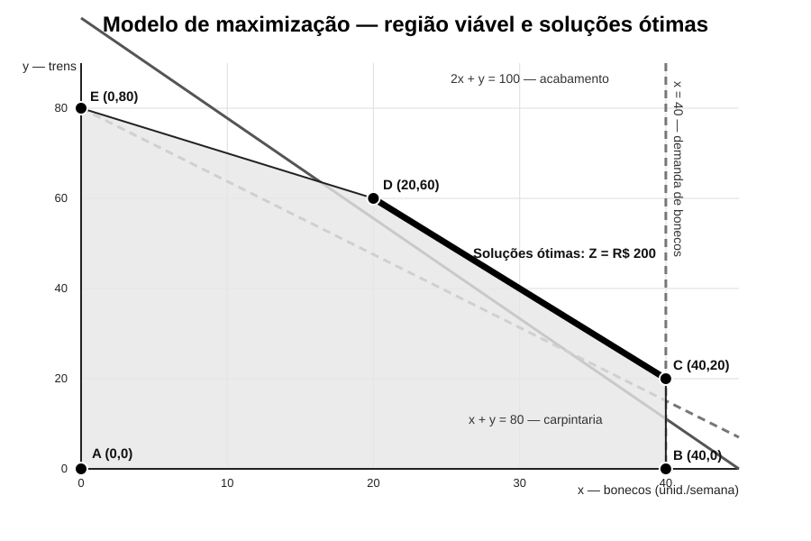

# Solução — Estudo de caso 01: Planejamento Semanal de Produção na Pinocchio S.A.

## Resumo

Este estudo aplica **Programação Linear** ao planejamento semanal da Pinocchio S.A., fabricante de bonecos e trens de madeira. O problema consiste em determinar o mix de produção que maximiza o lucro sob restrições de acabamento, carpintaria e demanda máxima de bonecos. A formulação e a análise gráfica mostram que há **múltiplas soluções ótimas**, pois a função lucro é proporcional à utilização da capacidade de acabamento. O lucro máximo é de **R$ 200,00 por semana**, obtido por todo o segmento entre `(20, 60)` e `(40, 20)`. Como critério secundário, `(40, 20)` é uma alternativa operacionalmente atraente por deixar 20 horas de carpintaria ociosas. Como extensão, formula-se um problema de minimização de custos com produção mínima de 80 unidades por semana. Nesse cenário, a solução ótima é produzir 80 trens, com custo de **R$ 240,00**.

**Palavras-chave:** Pesquisa Operacional; Programação Linear; otimização; planejamento da produção.

## 1 Introdução

A Pesquisa Operacional emprega modelos quantitativos para apoiar decisões em situações nas quais recursos são limitados e diferentes alternativas precisam ser comparadas. A Programação Linear é uma das técnicas fundamentais dessa área e permite representar problemas de alocação de recursos por meio de uma função objetivo linear e de restrições lineares (Hillier; Lieberman, 2013).

No caso da Pinocchio S.A., a decisão consiste em determinar quantos bonecos e trens devem ser produzidos semanalmente. O objetivo original é maximizar o lucro, respeitando as capacidades de acabamento e carpintaria e o limite de demanda dos bonecos.

O objetivo deste trabalho é formular o problema matematicamente, determinar sua solução ótima por análise gráfica, interpretar os recursos que limitam a produção e avaliar uma extensão na qual a empresa passa a minimizar o custo de produção. A análise segue a abordagem clássica de modelagem e solução de problemas de Programação Linear (Arenales et al., 2015).

## 2 Metodologia

Foram utilizadas exclusivamente as informações quantitativas do enunciado original disponível em `Docs/Estudo de caso 01`. A solução foi validada por três procedimentos complementares: (i) formulação algébrica; (ii) enumeração e avaliação dos vértices da região viável; e (iii) verificação independente por um programa em **R**, disponível em `verificacao_estudo_caso_01.R`.

A análise gráfica considera `x` no eixo horizontal e `y` no eixo vertical. Em Programação Linear, quando a região viável é um polígono convexo e a função objetivo é linear, a análise dos pontos extremos permite identificar uma solução ótima; quando a função objetivo é paralela a uma aresta ótima, pode existir um conjunto contínuo de soluções ótimas (Hillier; Lieberman, 2013).

### 2.1 Dados do problema

| Produto | Preço (R$) | Matéria-prima (R$) | Mão de obra (R$) | Lucro unitário (R$) | Acabamento (h) | Carpintaria (h) |
| --- | ---: | ---: | ---: | ---: | ---: | ---: |
| Boneco | 27 | 10 | 13 | 4 | 2 | 1 |
| Trem | 21 | 9 | 10 | 2 | 1 | 1 |

A disponibilidade semanal é de **100 horas de acabamento** e **80 horas de carpintaria**. A demanda máxima é de **40 bonecos por semana**, enquanto a demanda por trens é considerada ilimitada.

## 3 Modelagem matemática

### 3.1 Variáveis de decisão

- `x` = quantidade de bonecos produzidos por semana;
- `y` = quantidade de trens produzidos por semana.

### 3.2 Modelo de maximização

A função objetivo é:

```text
Max Z = 4x + 2y
```

sujeita às restrições:

```text
2x + y <= 100        (acabamento)
x + y <= 80          (carpintaria)
x <= 40               (demanda máxima de bonecos)
x >= 0, y >= 0        (não negatividade)
```

O primeiro modelo representa diretamente o problema proposto no enunciado. A solução deve pertencer à região que satisfaz simultaneamente todas as restrições.

## 4 Resolução gráfica

A representação gráfica permite visualizar a região viável e o conjunto de soluções ótimas. A Figura 1 foi construída diretamente a partir das equações do modelo e está armazenada como gráfico vetorial em `graficos/maximizacao.svg`.



**Figura 1 — Região viável, restrições e segmento de soluções ótimas.**  
*Fonte: elaboração própria, com base nos dados do enunciado da atividade (Universidade Católica de Brasília, 2026).*

As retas relevantes são `2x + y = 100`, correspondente à capacidade de acabamento; `x + y = 80`, correspondente à capacidade de carpintaria; e `x = 40`, correspondente ao limite de demanda dos bonecos.

### 4.1 Vértices da região viável

Os principais pontos extremos são:

| Vértice | x (bonecos) | y (trens) | Acabamento (h) | Carpintaria (h) | Lucro (R$) |
| --- | ---: | ---: | ---: | ---: | ---: |
| A | 0 | 0 | 0 | 0 | 0 |
| B | 40 | 0 | 80 | 40 | 160 |
| C | 40 | 20 | 100 | 60 | **200** |
| D | 20 | 60 | 100 | 80 | **200** |
| E | 0 | 80 | 80 | 80 | 160 |

O maior valor da função objetivo entre os vértices é R$ 200,00, atingido em `C` e `D`.

### 4.2 Demonstração da multiplicidade da solução ótima

A função objetivo pode ser reescrita como:

```text
Z = 4x + 2y = 2(2x + y)
```

A expressão `2x + y` é exatamente o lado esquerdo da restrição de acabamento. Como `2x + y <= 100`, segue diretamente que:

```text
Z <= 2(100) = 200
```

Logo, **R$ 200,00 é um limite superior para o lucro**. Esse limite é atingido sempre que `2x + y = 100` e as demais restrições são satisfeitas.

Na reta ótima, temos:

```text
y = 100 - 2x
```

A restrição de carpintaria exige:

```text
x + y <= 80
x + 100 - 2x <= 80
100 - x <= 80
x >= 20
```

Com `x <= 40` e `y >= 0`, obtém-se:

```text
20 <= x <= 40
 y = 100 - 2x
```

Portanto, a solução ótima **não é um único ponto**, mas todo o segmento entre `(20, 60)` e `(40, 20)`. Em um modelo contínuo, qualquer ponto desse segmento é ótimo; se as quantidades forem exigidas como inteiras, existem 21 soluções ótimas inteiras, correspondentes a `x = 20, 21, ..., 40`.

### 4.3 Escolha gerencial entre soluções ótimas

Como todas as soluções do segmento geram o mesmo lucro, um critério secundário pode ser usado para selecionar uma alternativa operacional. A escolha `(40, 20)` utiliza:

- acabamento: `2(40) + 20 = 100 h`, portanto 100% da capacidade;
- carpintaria: `40 + 20 = 60 h`, deixando **20 h de folga**;
- demanda de bonecos: `40/40`, atingindo o limite de venda;
- lucro: **R$ 200,00 por semana**.

Assim, `(40, 20)` é uma escolha racional se a empresa valorizar maior folga de carpintaria, embora não seja matematicamente superior às demais soluções do segmento quanto ao lucro.

## 5 Extensão — minimização de custos

O enunciado propõe uma mudança do objetivo: minimizar o custo total de produção, considerando custos unitários de R$ 5 por boneco e R$ 3 por trem. Como a minimização sem uma exigência de produção conduziria à solução trivial `(0, 0)`, é necessário explicitar uma premissa adicional.

Adota-se, para fins da extensão, uma **produção mínima de 80 unidades por semana**. Essa hipótese é coerente com a capacidade máxima de carpintaria, pois cada unidade consome uma hora desse recurso.

### 5.1 Modelo de minimização

```text
Min C = 5x + 3y
```

sujeito a:

```text
2x + y <= 100        (acabamento)
x + y <= 80          (carpintaria)
x <= 40               (demanda máxima de bonecos)
x + y >= 80          (produção mínima adotada)
x >= 0, y >= 0        (não negatividade)
```

As duas restrições de produção total implicam imediatamente:

```text
x + y = 80
```

Logo, `y = 80 - x` e a função custo se torna:

```text
C = 5x + 3(80 - x)
C = 240 + 2x
```

Como `x >= 0`, o menor custo ocorre em `x = 0`. Assim:

```text
x = 0
 y = 80
 C = R$ 240,00
```

A solução é viável, pois utiliza 80 horas de acabamento e 80 horas de carpintaria e respeita o limite de bonecos.

### 5.2 Interpretação

O resultado decorre da diferença de custos unitários: cada boneco custa R$ 5, enquanto cada trem custa R$ 3. Como a extensão exige exatamente 80 unidades e ambos consomem uma hora de carpintaria por unidade, substituir um trem por um boneco aumenta o custo em R$ 2. Portanto, a solução de menor custo é produzir somente trens.

É importante destacar que **a produção mínima de 80 unidades é uma hipótese introduzida para resolver a extensão**, e não um dado originalmente fornecido pela empresa. Essa distinção evita apresentar uma premissa de modelagem como se fosse informação do enunciado.

## 6 Comparação dos modelos

| Aspecto | Maximização de lucro | Minimização de custos |
| --- | --- | --- |
| Objetivo | `Max 4x + 2y` | `Min 5x + 3y` |
| Restrição adicional | — | `x + y >= 80` |
| Solução característica | Segmento entre `(20,60)` e `(40,20)` | `(0,80)` |
| Produção total em `(40,20)` | 60 unidades | — |
| Produção total na extensão | — | 80 unidades |
| Uso de acabamento | 100 h nas soluções ótimas | 80 h |
| Uso de carpintaria em `(40,20)` | 60 h | 80 h |
| Resultado | Lucro máximo de R$ 200 | Custo mínimo de R$ 240 |

A alteração da função objetivo modifica a decisão ótima. No problema original, o acabamento é o recurso que determina o limite superior do lucro e há múltiplas soluções ótimas. Na extensão, a meta de 80 unidades torna a carpintaria totalmente utilizada, e o trem passa a ser favorecido pelo menor custo unitário.

## 7 Conclusão e discussão gerencial

A aplicação da Programação Linear ao caso da Pinocchio S.A. mostra a importância de distinguir entre **uma solução ótima** e **um conjunto de soluções ótimas**. A análise algébrica demonstra que o lucro máximo é limitado superiormente por `2(100) = R$ 200,00` e que esse valor é atingido por todo o segmento `20 <= x <= 40`, com `y = 100 - 2x`.

A solução `(40,20)` pode ser selecionada por um critério gerencial secundário, pois preserva o lucro máximo e deixa 20 horas de carpintaria disponíveis. Essa escolha, entretanto, não deve ser apresentada como a única solução ótima do problema original.

Na extensão, a adoção explícita da produção mínima de 80 unidades elimina a solução trivial de não produzir. O modelo passa então a favorecer exclusivamente os trens, cujo custo unitário é menor. O exercício evidencia, portanto, que a função objetivo e as premissas adicionais podem alterar significativamente a decisão recomendada.

Como evolução do modelo, podem ser incorporados demanda limitada para trens, custos fixos, horas extras, estoques, capacidade de matéria-prima, múltiplos períodos e restrições de mercado. Essas extensões aproximariam o modelo de uma ferramenta de planejamento operacional mais realista.

## Referências

ARENALES, Marcos et al. **Pesquisa operacional**. 2. ed. Rio de Janeiro: Elsevier, 2015.

HILLIER, Frederick S.; LIEBERMAN, Gerald J. **Introdução à pesquisa operacional**. 9. ed. Porto Alegre: AMGH, 2013.

UNIVERSIDADE CATÓLICA DE BRASÍLIA. **Pesquisa Operacional — Estudo de caso 01: Planejamento Semanal de Produção na Pinocchio S.A.** Documento de atividade avaliativa. Brasília, DF: Universidade Católica de Brasília, 2026.

> **Nota de normalização.** A lista de referências foi padronizada em ordem alfabética e com destaque tipográfico uniforme dos títulos. As citações no corpo do texto seguem o sistema autor-data, em conformidade com a ABNT NBR 10520:2023; a elaboração da lista de referências segue a ABNT NBR 6023. A formatação final em editor de texto deve preservar margem, fonte, espaçamento, paginação e demais elementos exigidos pela instituição de ensino.
